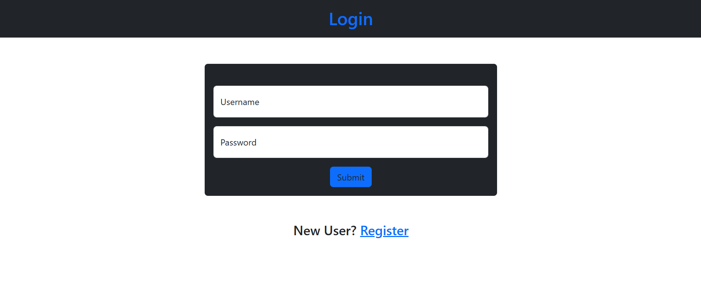
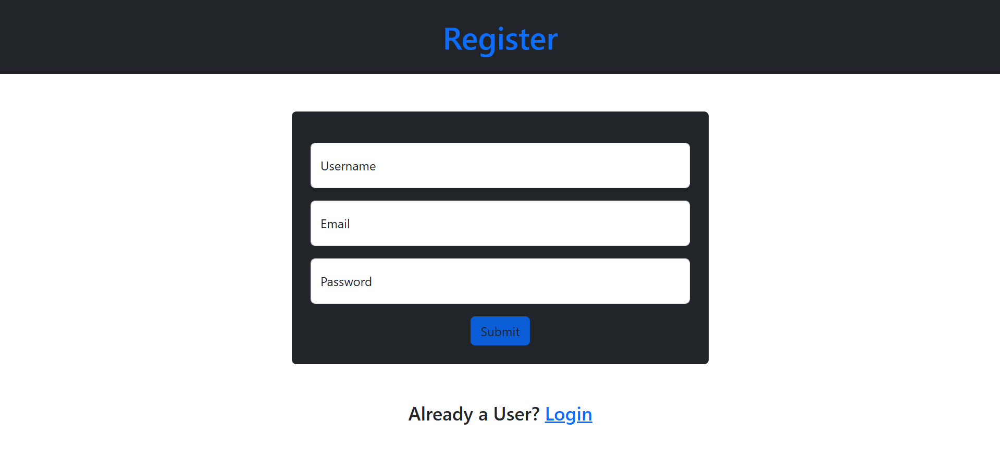
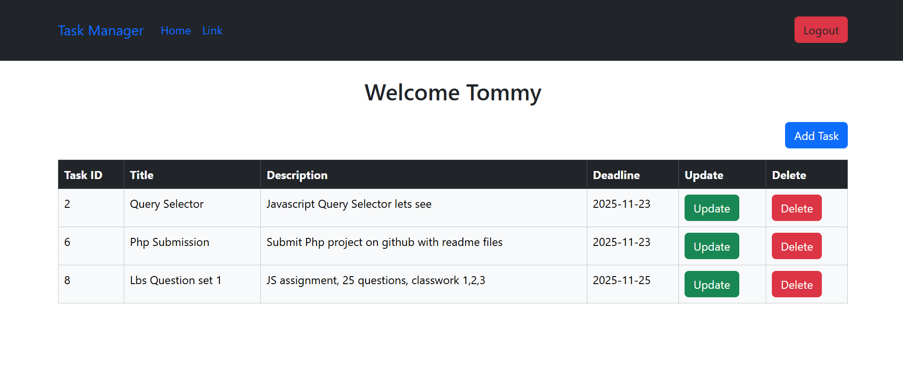

# php-task-manager1.0

A simple php task manager with crud and Registration/Login

# Version 2.0, Tech used: 
## UI - Bootstrap 5 
## Backend - PHP, JS
## Database - Mysql
## hosted locally with Apache (Xampp)

Can Perform ***Crud*** Operations Like **Add,Update,Delete and Show** tasks,Generates Table in **CSV** And **PDF** Format which user can download, Used Php Sessions for better user management with login and logout.

### Login Page

### Register Page

### Home Page

### UPDATE v2.0 (Beta)
2 buttons besides logout, that helps user to get the table in pdf, or csv format, also uploaded the database. will update the images later with final 2.0 version, next updates will ***probably*** have only ui changes.

#### You Need TCPDF Library to get pdfs working
**Install Composer, to get php libraries**
**paste on ur cmd: composer require tecnickcom/tcpdf;**

### if any queries or suggestions or errors plz contact me @ linkedin : [Mithil Dhure](https://in.linkedin.com/in/mithil-dhure-b78a98257)

Feel Free to use or modify!!

